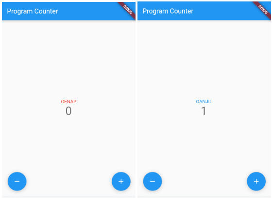

Nama    : TM Revanza Narendra Pradipta

NPM     : 2206025003

Kelas   : PBP A


# TUGAS 7
# Apa yang dimaksud dengan *Stateless widget* dan *Stateful widget* dan jelaskan perbedaan dari keduanya!
*Stateless widget* adalah widget yang *state*-nya tidak bisa diubah setelah diinisiasi, sementara *stateful widget* adalah widget yang *state*-nya bisa diubah setelah diinisiasi. Jadi, jika suatu widget bisa berubah saat ada interaksi *user*, maka widget tersebut bersifat *stateful*, sedangkan *stateless widget* tidak dapat bisa diubah.

# Sebutkan widget apa saja yang kamu pakai di proyek kali ini dan jelaskan fungsinya!
Widget-widget yang saya gunakan pada proyek kali ini adalah:
- **Scaffold**, widget utama untuk membuat halaman Flutter.
- **Center**, menempatkan *child* di tengah *parent*.
- **Column**, mengatur *list of children* untuk tersusun secara vertikal.
- **Text**, menampilkan dan menghias sebuah teks.
- **Padding**, menyisipkan *child* dengan ukuran *padding* yang diberikan.
- **Row**, mengatur *list of children* untuk tersusun secara horizontal.
- **Expanded**, mengembangkan *child* di dalamnya, dalam proyek ini `expanded` digunakan untuk memberi *space* antara tombol *decrement* dan *increment*.
- **Container**, menampung *widget* umum seperti `painting`, `positioning`, dan `sizing`.
- **Icon**, menampung material `icon`.

# Apa fungsi dari `setState()`? Jelaskan variabel apa saja yang dapat terdampak dengan fungsi tersebut!
`setState()` berfungsi untuk memberi tahu *framework* bahwa terdapat perubahan *value* di dalam *state* yang memanggil fungsi `setState()`. Setelah *framework* mengetahui adanya perubahan, maka *framework* akan menjalankan ulang *build method* sehingga aplikasi dapat menampilkan ulang dengan *value* terbaru.

# Jelaskan perbedaan antara `const` dengan `final`!
Secara fungsi, `const` dan `final` tidak memiliki perbedaan, keduanya sama-sama berfungsi untuk menjaga *value* dari sebuah variabel bersifat statik, artinya variabel tersebut tidak akan bisa diubah *value*-nya setelah didefinisikan. Perbedaannya adalah bahwa `const` membuat sebuah variabel bersifat konstan dari *compile-time* saja. Artinya, *value* dari variabel dengan *keyword* `const` harus berupa data yang hanya bisa dikalkulasikan di *compile-time*, objek `const` tidak memiliki akses ke sesuatu yang harus dikalkulasikan di *runtime*, sehingga fungsi seperti `DateTime.now()` tidak bisa didefinisikan sebagai variabel `const` karena nilainya dapat berubah-ubah.

# Jelaskan bagaimana cara kamu mengimplementasikan *checklist* di atas!

1. **Membuat sebuah program Flutter baru dengan nama `counter_7`.**

    Pada *root directory*, program Flutter di-*generate* di cmd dengan perintah `flutter create counter_7`.

2. **Mengubah tampilan program menjadi seperti berikut.**

    

    Untuk kata GENAP dan GANJIL, saya membuat sebuah variabel `_kata` yang akan berubah sesuai dengan nilai `_counter`. Berikut potongan kode untuk menambahkan GENAP atau GANJIL ini,
    ```
    children: <Widget>[
            Text(
              _kata,
              style: TextStyle(
                  color: _kata == "GANJIL" ? Colors.blue : Colors.red),
            ),
            ...
    ```
    Potongan kode di atas terletak di dalam *child* dari *body Scaffold* yang di-*return* oleh *build method*.

    Lalu untuk tombol *decrement* dan *increment* di sudut bawah didapatkan dari penambahan kode di dalam *body Scaffold* yang di-*return* oleh *build method*, kodenya sebagai berikut,
    ```
    floatingActionButton: Padding(
        padding: const EdgeInsets.only(left: 30),
        child: Row(crossAxisAlignment: CrossAxisAlignment.end, children: [
          Visibility(
            visible: _counter == 0 ? false : true,
            child: FloatingActionButton(
              onPressed: _decrementCounter,
              tooltip: 'Decrement',
              child: const Icon(Icons.remove)
            ),
          ),
          Expanded(child: Container()),
          FloatingActionButton(
            onPressed: _incrementCounter,
            tooltip: 'Increment',
            child: const Icon(Icons.add)
          ),
        ]),
      )
    ```
    Ide dari potongan kode di atas dimulai dari menambahkan `FloatingActionButton` baru dengan dengan icon di dalamnya berbentuk minus yang menandakan *decrement*. Hasil dari penambahan tombol tersebut adalah tombol *increment* dan *decrement* saling berdempet di pojok kiri aplikasi, oleh sebab itu saya menambahkan ```Expanded(child: Container()),``` di antara dua tombol untuk memberi *space* di antaranya, hasilnya memang tombol *decrement* berada di sisi kiri dan tombol *increment* berada di sisi kanan, tetapi letak kedua tombol berpindah dari yang tadinya di bawah menjadi ke tengah aplikasi, sehingga saya memasukkan kode ```Row(crossAxisAlignment: CrossAxisAlignment.end, children: [...])``` dan memasukkan *widget* tombol-tombol yang sudah saya buat ke *children* dari *Row*, akhirnya hasilnya sesuai dengan yang ada di tampilan soal, tetapi tombol *decrement* agak tidak simetris karena hampir 30% dari tombol tidak terlihat karena agak keluar dari *border*, oleh sebab itu saya memasukkan kode 
    ```
    Padding(
        padding: const EdgeInsets.only(left: 30),
        child:...
    ```
    Lalu memasukkan `Row` yang sebelumnya saya buat ke dalam *child*-nya.
    
3. **Mengimplementasikan logika berikut pada program.**

    - **Tombol + menambahkan angka sebanyak satu satuan.**

        Dari potongan kode yang saya masukkan di poin ke-2 di atas, terlihat bahwa tombol *increment* akan memanggil fungsi `_incrementCounter` saat diklik. Berikut kode dari fungsi tersebut:
        ```
        int _counter = 0;
        String _kata = "GENAP";
        void _incrementCounter() {
            setState(() {
                _counter++;
                _kata = _oddEven();
            });
        }
        ```
        Sederhana saja, kode tersebut akan meng-*increment* variabel `_counter`.

    - **Tombol - mengurangi angka sebanyak satu satuan. Apabila counter bernilai 0, maka tombol - tidak memiliki efek apapun pada counter.**

        Dari potongan kode yang saya masukkan di poin ke-2 di atas, terlihat bahwa tombol *decrement* akan memanggil fungsi `_decrementCounter` saat diklik. Berikut kode dari fungsi tersebut:
        ```
        void _decrementCounter() {
            setState(() {
                _counter <= 0 ? _counter = 0 : _counter--;
                _kata = _oddEven();
            });
        }
        ```
        Program akan mengecek terlebih dahulu, apakah `_counter` kurang dari sama dengan 0 atau tidak, jika iya, maka `_counter` tetap bernilai 0, jika tidak, maka `_counter` akan di-*decrement*.
    
    - **Apabila counter bernilai ganjil, maka teks indikator berubah menjadi "GANJIL" dengan warna biru dan apabila counter bernilai genap, maka teks indikator berubah menjadi "GENAP" dengan warna merah.**

        Dari *method* `_decrementCounter()` dan `_incrementCounter()`, terdapat potongan kode `_kata = _oddEven()`, artinya variabel `_kata` ditentukan berdasarkan hasil return dari *method* `_oddEven()`, isi dari *method* ini adalah sebagai berikut,
        ```
        String _oddEven() {
            return _counter % 2 == 1 ? "GANJIL" : "GENAP";
        }
        ```
        Lalu, dari potongan kode yang saya masukkan di poin ke-2 di atas, terlihat pada *widget* `text` terdapat potongan kode ```style: TextStyle(color: _kata == "GANJIL" ? Colors.blue : Colors.red),```, dari sini terdapat logika *conditional* bahwa jika `_kata` sama dengan "GANJIL", maka kata akan dihias dengan warna biru, sedangkan jika "GENAP" akan dihias dengan warna merah.


# TUGAS 8
# Jelaskan perbedaan `Navigator.push` dan `Navigator.pushReplacement`!
`Navigator.push` hanya akan menambahkan rute ke *page* yang di-*push* ke dalam *stack* Navigator, sedangkan `Navigator.pushReplacement` akan menambahkan rute dan juga menghilangkan rute sebelumnya.

# Sebutkan widget apa saja yang kamu pakai di proyek kali ini dan jelaskan fungsinya!
Widget-widget yang saya gunakan pada proyek kali ini adalah:
- **Scaffold**, widget utama untuk membuat halaman Flutter.
- **Center**, menempatkan *child* di tengah *parent*.
- **Column**, mengatur *list of children* untuk tersusun secara vertikal.
- **Text**, menampilkan dan menghias sebuah teks.
- **Padding**, menyisipkan *child* dengan ukuran *padding* yang diberikan.
- **Row**, mengatur *list of children* untuk tersusun secara horizontal.
- **Expanded**, mengembangkan *child* di dalamnya, dalam proyek ini `expanded` digunakan untuk memberi *space* antara tombol *decrement* dan *increment*.
- **Container**, menampung *widget* umum seperti `painting`, `positioning`, dan `sizing`.
- **Icon**, menampung material `icon`.
- **Drawer**, Menampilkan rute navigasi pada sebuah panel di pinggir *body* aplikasi.
- **ListTile**, Menampilkan elemen berbentuk sebuah baris yang dapat berisi `icon` dan `text`.
- **Navigator**, Menavigasi ke *page* mana *user* ingin pergi.
- **Card**, Panel persegi di mana kita bisa memasukkan elemen-elemen di dalamnya.
- **SingleChildScrollView**, Supaya *child* di dalamnya dapat di-*scroll* dan mencegah *overflow*.
- **TextFormField**, Melakukan input sebuah data ke dalam *text field*.
- **TextButton**, Tombol dengan elemen teks di dalamnya.
- **DropdownButton**, Tombol yang menampilkan data-data pada menu *dropdown*.
- **Form**, Berisi *field-field* untuk melakukan input data.


# Sebutkan jenis-jenis *event* yang ada pada Flutter! (contoh: `onPressed`)
- `onPressed`: Fungsi akan dijalankkan saat sebuah tombol ditekan.
- `onTap`: Fungsi akan dijalankkan saat sebuah *widget* yang bisa ditekan, ditekan.
- `onSaved`: Fungsi akan dijalankan ketika sebuah `form` disimpan.

# Jelaskan bagaimana cara kerja `Navigator` dalam "mengganti" halaman dari aplikasi Flutter!
Cara kerja `Navigator` adalah dengan menggunakan *stack*. Halaman yang di-*push* akan berada di *top of stack*.

# Jelaskan bagaimana cara kamu mengimplementasikan *checklist* di atas!
Cara saya mengimplementasikan *checklist* di atas adalah dengan membuat *form* pada *file* `form.dart`, pada *file* ini, saya memasukkan *input field* yang dibutuhkan. Lalu data-data yang sudah *user* masukkan akan di-*format* sedemikian rupa menjadi sebuah `Card`, `Card` yang sudah terbuat akan dimasukkan ke dalam `list` dengan tipe data `Widget` yang ada di *file* `data.dart`, kemudian `list` tersebut hanya perlu ditampilkan sebagai `children` dari *widget* `Column` pada `body`.

# TUGAS 9
# Apakah bisa kita melakukan pengambilan data JSON tanpa membuat model terlebih dahulu? Jika iya, apakah hal tersebut lebih baik daripada membuat model sebelum melakukan pengambilan data JSON?
Bisa saja, tetapi dengan membuat model akan lebih memudahkan untuk dibaca dan identifikasi *bug*.

# Sebutkan widget apa saja yang kamu pakai di proyek kali ini dan jelaskan fungsinya.
Widget-widget yang saya gunakan pada proyek kali ini adalah:
- **Scaffold**, widget utama untuk membuat halaman Flutter.
- **Center**, menempatkan *child* di tengah *parent*.
- **Column**, mengatur *list of children* untuk tersusun secara vertikal.
- **Text**, menampilkan dan menghias sebuah teks.
- **Padding**, menyisipkan *child* dengan ukuran *padding* yang diberikan.
- **Row**, mengatur *list of children* untuk tersusun secara horizontal.
- **Expanded**, mengembangkan *child* di dalamnya, dalam proyek ini `expanded` digunakan untuk memberi *space* antara tombol *decrement* dan *increment*.
- **Container**, menampung *widget* umum seperti `painting`, `positioning`, dan `sizing`.
- **Icon**, menampung material `icon`.
- **Drawer**, Menampilkan rute navigasi pada sebuah panel di pinggir *body* aplikasi.
- **ListTile**, Menampilkan elemen berbentuk sebuah baris yang dapat berisi `icon` dan `text`.
- **Navigator**, Menavigasi ke *page* mana *user* ingin pergi.
- **Card**, Panel persegi di mana kita bisa memasukkan elemen-elemen di dalamnya.
- **SingleChildScrollView**, Supaya *child* di dalamnya dapat di-*scroll* dan mencegah *overflow*.
- **TextFormField**, Melakukan input sebuah data ke dalam *text field*.
- **TextButton**, Tombol dengan elemen teks di dalamnya.
- **DropdownButton**, Tombol yang menampilkan data-data pada menu *dropdown*.
- **Form**, Berisi *field-field* untuk melakukan input data.
- **RichText**, Dapat berisi lebih dari satu teks dengan *style* yang berbeda.
- **InkWell**, Panel yang mirip dengan `card` tetapi dapat diklik.
- **FutureBuilder**, Membuat *widget* yang dapat *build* dirinya sendiri berdasarkan `Snapshot` terakhir dengan `Future`.

# Jelaskan mekanisme pengambilan data dari json hingga dapat ditampilkan pada Flutter.
*Widget* `FutureBuilder` memanggil fungsi `fetch`, dalam tugas ini memanggil fungsi `fetchMyWatchlist`. Dari pemanggilan fungsi tersebut, diambil data dari https://tugas2-revanza.herokuapp.com/mywatchlist/json, data yang diambil akan diubah menjadi objek dari class `MyWatchlist`. Setelah diubah menjadi objek baru datap ditampilkan pada halaman flutter.

# Jelaskan bagaimana cara kamu mengimplementasikan checklist di atas.
Pertama menambahkan dependensi HTTP, dan mengimpor *package-package* yang esensial. Lalu menyalin data JSON pada tugas mywatchlist sebelumnya, mengubah data menjadi model di Quicktype dan memasukkannya ke file pada direktori model.Lalu membuat class `MyWatchlistPage` yang dapat melakukan pengambilan data dari URL https://tugas2-revanza.herokuapp.com/mywatchlist/json. Selanjutnya hanya perlu menampilkan data dengan `FutureBuilder()` yang dipelajari pada lab8. Memodifikasi sedikit supaya data-data dapat diklik dan menavigasi ke page detail.